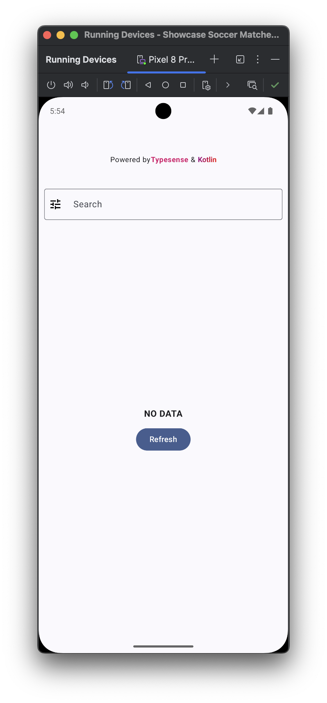
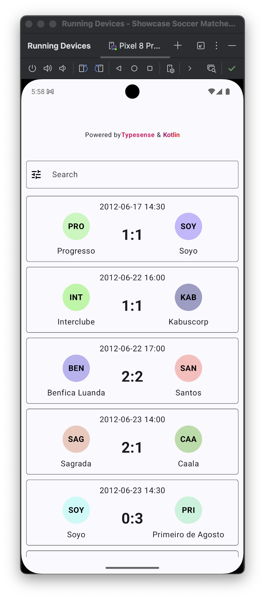
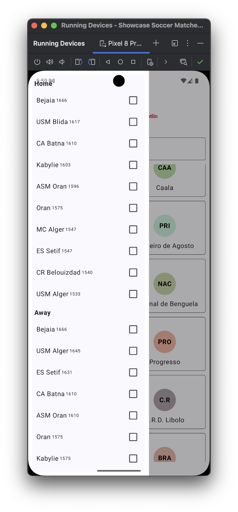

<h1>Search Soccer Matches, powered by Typesense & Kotlin</h1>

This search experience is powered by [Typesense](https://typesense.org) which is a blazing-fast, [open source](https://github.com/typesense/typesense) typo-tolerant search-engine. It is an open source alternative to Algolia and an easier-to-use alternative to ElasticSearch.

## Development

### Project Structure

    /
    ├── typesense/
    │   ├── compose.yml # help you setup the typsesense server with default data
    │   ├── default_data.jsonl
    │   ├── Dockerfile
    │   └── entrypoint.sh
    └── app/
        └── src/main/java/com/example/showcase_soccer_matches_search_kotlin_compose/
            ├── components
            ├── ...
            └── utils
                └── typesense.kt # Typesense client

### Setting Up a the Typesense server locally
To run this project locally, make sure your Typesense server is started:

#### Update the Typesense server env (OPTIONAL) : 
- Update the Typesense server in the [Dockerfile](typesense/Dockerfile#L5)

```
ENV TYPESENSE_DATA_DIR=/data
ENV TYPESENSE_API_KEY=xyz
ENV TYPESENSE_PORT=8108

ENV COLLECTION_NAME=soccer_matches
```

#### Build the typesense image and start it

```
cd typesense
# Start typesense server
docker compose up
```

### Setting Up the mobile app

- Update the Typesense client [here](/app/src/main/java/com/example/showcase_soccer_matches_search_kotlin_compose/utils/typesense.kt#L17) with your Typesense hostname ()

    ```
    nodes.add(
        Node(
            "http",
            "192.168.10.202", // your Typesense hostname
            "8108"
        )
    )

    val config = Configuration(nodes, Duration.ofSeconds(2), "xyz") // your Typesense API key
    ```
*IN A PRODUCTION, YOU WANT TO HAVE AN AUTHENTICATED BACKEND API ENDPOINT THAT RETURNS THE HOSTNAMES AND API KEYS, INSTEAD OF HARD-CODING IT IN THE APP*
- Then run the app

## Gallery

<div style="text-align: center">
    <table>
        <tr>
            <td style="text-align: center">
                
            </td>
            <td style="text-align: center">
                
            </td>
            <td style="text-align: center">
                
            </td>
        </tr>
    </table>
</div>
